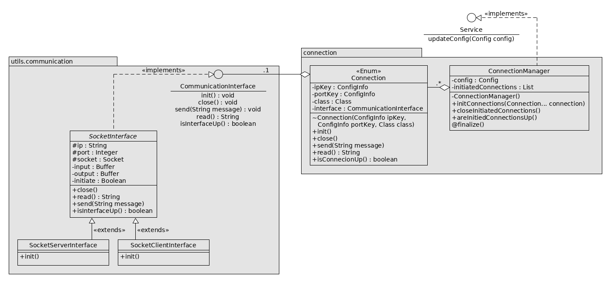

## MEMO
### MEMO - JAVA
#### JAVA - LANGUAGE
TODO
#### JAVA - CONVENTION
* Une Classe commence toujours par une majuscule, une instance par une minuscule :

        MaClasse monInstance = new MaClasse(...);

* Exception faite des champs **final** et des **instances d'enum**, qui doivent être en majuscule :

        public enum MonEnum {
            PREMIERE_INSTANCE,
            D_INSTANCE,
            ;

            public static final TIME_STEP   = 58;
        }

* Les méthodes doivent être documentées : une documentation doit expliquer à quoi sert la méthode,
  pas son fonctionnement interne. Si son fonctionnement interne est complexe et merite d'être
  détaillé, on ajoute du commentaire dans le corps de la méthode. Exemple de utils.math.Rectangle.java :

        /**
         * Ceci est une documentation (javadoc)
         * Cette méthode retourne true si notre rectangle contient un point
         * @param point point
         * @return      true si le rectangle contient un point
         */
        @Override
        public boolean isInShape(Vec2 point){
            return Math.abs(point.getX() - center.getX()) < this.length/2 &&
                    Math.abs(point.getY() - center.getY()) < this.width/2;
        }

        // Ceci est un commentaire
        /* Ca aussi, c'est
        un commentaire */

* Les fichiers sources de ce projet doivent avoir en entête le copyright Intech 2018 - GNU License (c'est mieux):

        /**
         * Copyright (c) 2018, INTech.
         * this file is part of INTech's HighLevel.
         *
         * INTech's HighLevel is free software: you can redistribute it and/or modify
         * it under the terms of the GNU General Public License as published by
         * the Free Software Foundation, either version 3 of the License, or
         * (at your option) any later version.
         *
         * INTech's HighLevel is distributed in the hope that it will be useful,
         * but WITHOUT ANY WARRANTY; without even the implied warranty of
         * MERCHANTABILITY or FITNESS FOR A PARTICULAR PURPOSE.  See the
         * GNU General Public License for more details.
         *
         * You should have received a copy of the GNU General Public License
         * along with it.  If not, see <http://www.gnu.org/licenses/>.
         **/

### MEMO - UML

1. Classes
    * Cercle (CommunicationInterface & Service) : **Interface**
    * _Intalique_ (SocketInterface) : **Classe Abstraite**
    * "Enum" Class (Connection) : **Enum**
    * Classe : **Classe**

2. Champs & Methodes
    * \- private
    * \+ public
    * \# protected
    * \~ package-private
    * <u>FieldOrMethods</u> static
    * @ surcharge
