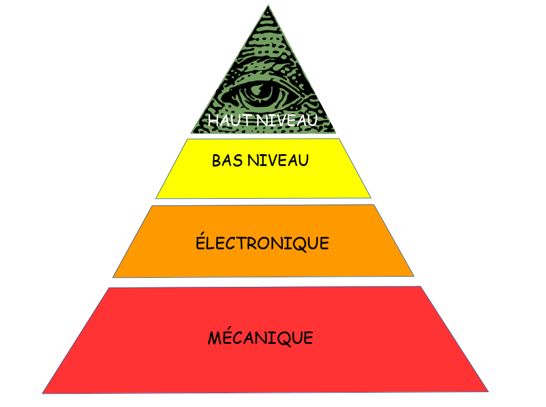
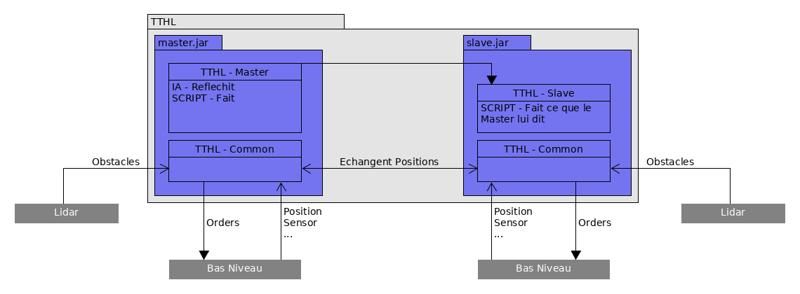
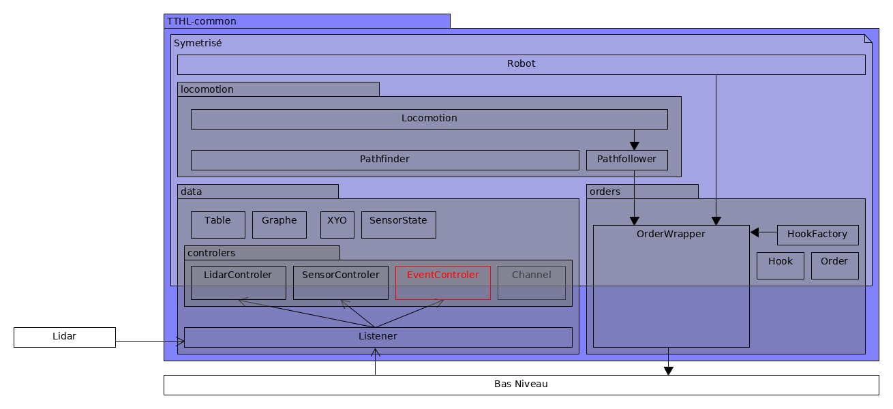

%TT(H)L
%TechTheHighLevel
%TechThe**[Please choose a name \>_]**

# (TT)HL - C'est quoi ?
{ width=85% }

# TTHL - Qu'est-ce qu'il fait ?
{ width=105% }

# TTHL - Common
{ width=105% }

# TTHL - Master & Slave
Alors la...
